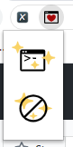

# SFWAO3
Safe for Work AO3 -- Add code-like stuffs in ao3 articles to pretend that I am coding! :P

1. load this chrome extension.
2. Just open an A03 article page and click the extension (only support chapter by chapter view right now)
3. Two buttons in popup. Upper one is to randomly generate code-like stuffs in current page (click one more time to re-generate them); bottom one is to reset the page.

